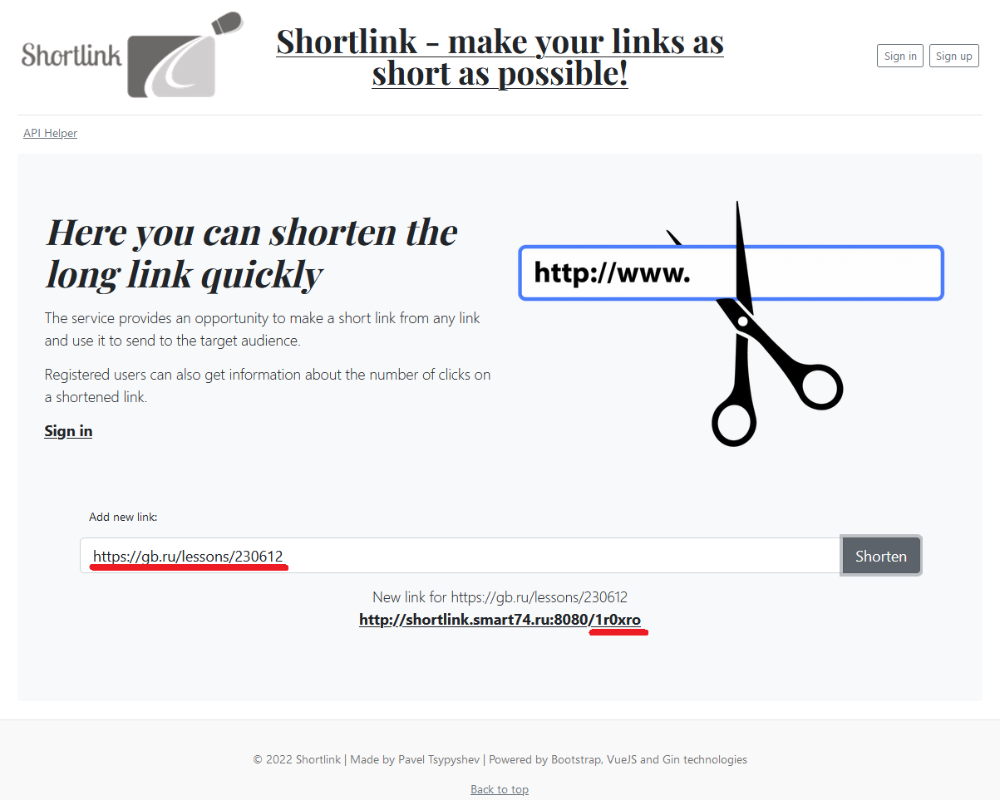
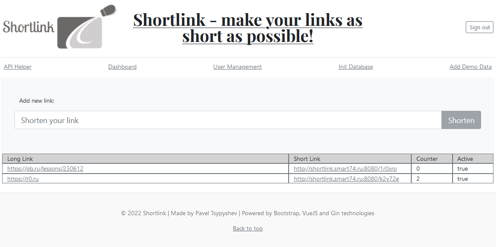
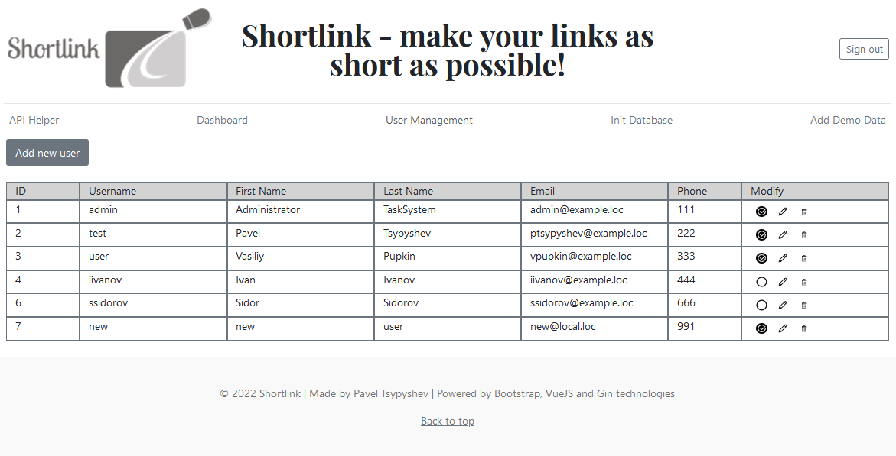
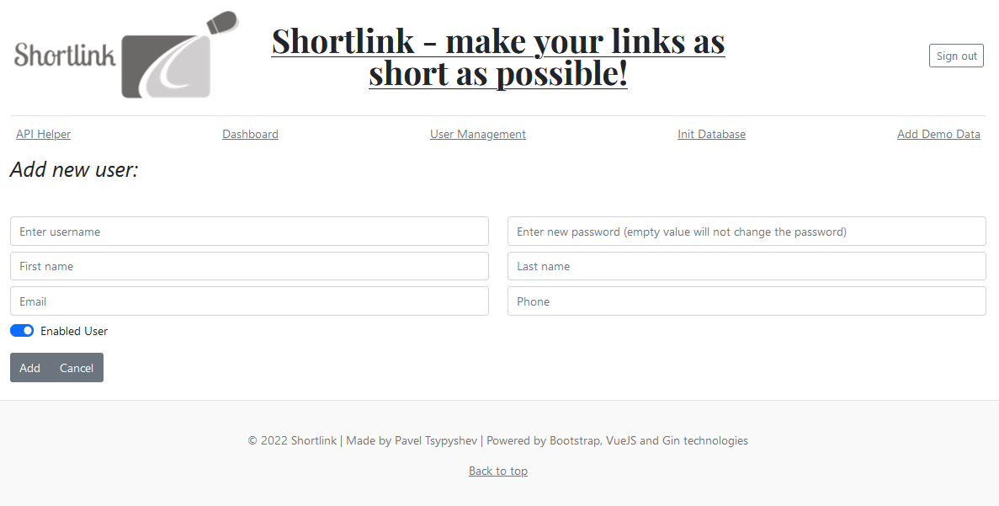

# gb-golang-backend-course-project
GeekBrains Course Golang-Backend-Level01 repository for course project
## Project's goal
It is an URL shortener service - it can generate a short version of arbitrary user's URL.
Also user can get statistics for URL generated url (how much people followed the link).

## What technologies were used
1. OpenAPI/Swagger - to describe API functionality
2. Gin - to provide web-service (backend)
3. Bootstrap & VueJS - to provide frontend
4. Hashids - to generate hash by link id
5. PostgreSQL - to store data in database
6. Docker & Docker compose - to run services in containers

## How to deploy
1. Clone git repository `git clone https://github.com/ptsypyshev/shortlink.git`
2. In project directory run `docker-compose up`
3. Go to the http://localhost:8080/

## Screenshots
Main page:

Shortlinks Dashboard:

User Management:

User Creation Form:

## About me
  
Pavel Tsypyshev (Павел Цыпышев) https://gb.ru/users/2008377
